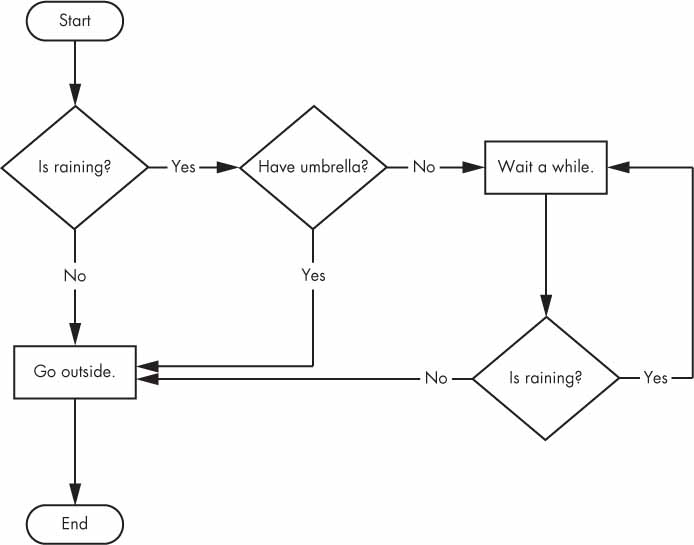
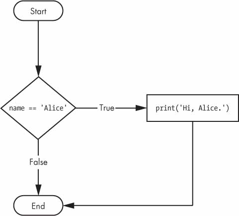
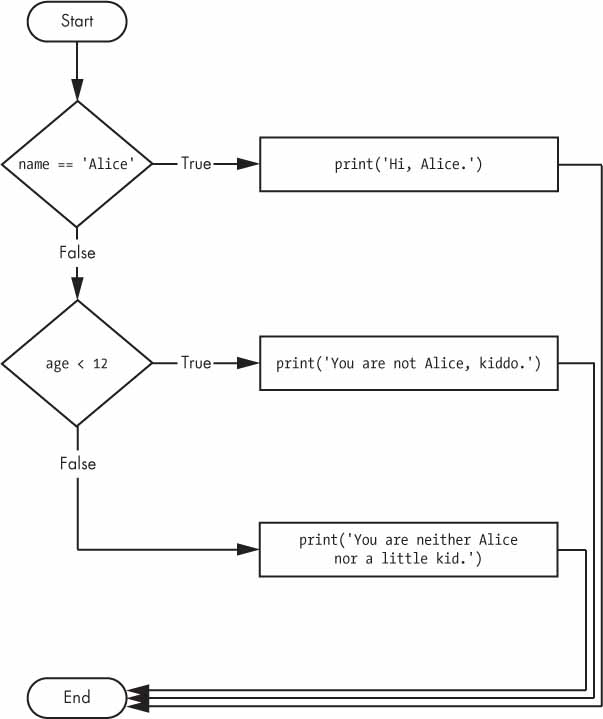
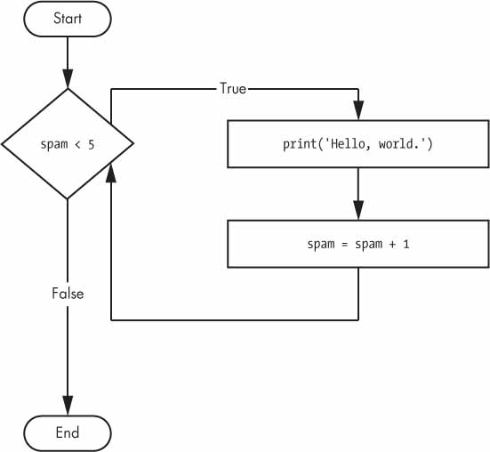
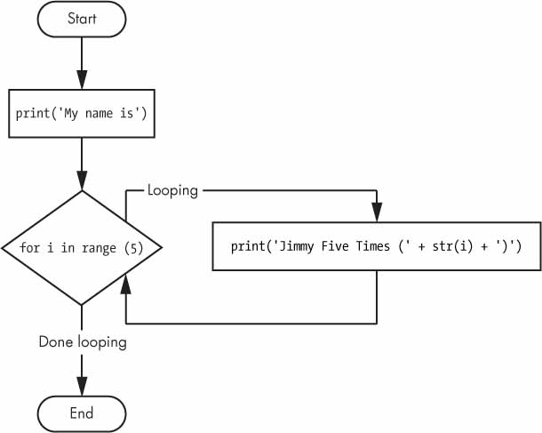

# Automate the Boring Stuff
Using the book as a proxy for a beginner's course. The learnings here will be based on the 2nd edition of the book.

### 0. What is programming?
Programming is simply the act of entering instructions for the computer to perform. All programs use basic instructions 
as building blocks. You can combine these building blocks to implement more intricate decisions

### 1. Python Basics

#### 1.1 Expressions
In Python, the most basic kind of programming instruction is called an *expression* (e.g 2+2). Expressions consist of 
values (2) and operators (+), and they can always evaluate (that is, reduce) down to a single value. That means you can 
use expressions anywhere in Python code that you could also use a value. A single value with no operators is also 
considered an expression, though it evaluates only to itself. There are many other math operators in python, such as:

*Table 1: Math operators in Python*

| Operator | Operation         | Example | Evaluation |
|----------|-------------------|---------|------------|
| **       | Exponent          | 2 ** 3  | 8          |
| %        | Modulus/remainder | 22 % 8  | 6          |
| //       | Integer division  | 22 // 8 | 2          |
| /        | Division          | 22 / 8  | 2.75       |
| *        | Multiplication    | 3 * 5   | 15         |
| -        | Subtraction       | 5 - 2   | 3          |
| +        | Addition          | 2 + 2   | 4          |

The order of operations (precedence) follows mathematics. You can use parentheses to override the usual precedence if 
you need to. Whitespace in between the operators and values doesn’t matter for Python (except for the indentation at the
beginning of the line), but a single space is convention. These rules for putting operators and values together to form 
expressions are a fundamental part of Python as a programming language, just like the grammar rules that help us 
communicate.

#### 1.2 Data Types
A data type is a category for values, and every value belongs to exactly one data type. The most common data types in 
Python are:
- Integer (or int) data type indicates values that are whole numbers
- Floating-point numbers (or floats) are numbers with a decimal point
- Strings (or strs) are text values. Surround your string in single quote (') characters so Python knows where the 
string begins and ends

NB: The meaning of an operator may change based on the data types of the values next to it, e.g. a "+" operator will add
int values together but concatenate strings

#### 1.3 Variables
A variable is like a box in the computer’s memory where you can store a single value. If you want to use the result of 
an evaluated expression later in your program, you can save it inside a variable using an *assignment statement*. An 
assignment statement consists of a variable name, an equal sign (called the *assignment operator*), and the expression.
An example is assigning the number of days as 30, e.g. `days = 30`.

A variable is initialized (created) the first time a value is stored in it. After that, you can use it in expressions 
with other variables and values. When a variable is assigned a new value, the old value is forgotten and variable 
overwritten.

A good variable name describes the data it contains (e.g. labelling a box "stuff" when moving may not be as helpful as 
"pots"). Variable names are case-sensitive so `Name` and `name` are different variables. You can name a variable 
anything as long as it obeys the following three rules:
- Can be only one word with no spaces
- Use only letters, numbers, and the underscore (_) character
- Can’t begin with a number

### 2. Flow Control

#### 2.1 Intro
A program is a series of instructions or expressions, but programming’s real strength isn’t just running one instruction after another 
like a weekend errand list. Based on how expressions evaluate, a program can decide to skip instructions, repeat them, 
or choose one of several instructions to run. Flow control statements can decide which Python instructions to execute 
under which conditions. This can best be observed as a flow chart where each shape and arrow indicates some thought 
process.

*Fig 1: What to do when it is raining?*


In a flowchart, there is usually more than one way to go from the start to the end. Flowcharts represent these branching
points with diamonds, while the other steps are represented with rectangles. The starting and ending steps are 
represented with rounded rectangles. Similar ideas can be implemented in code and an important building block to explore
is Boolean operators.

#### 2.2 Boolean Operators
The Boolean data type has only two values `True` and `False`. It is used in expressions and can be stored in variables.
*Comparison Operators* compare two values (or expressions) and evaluate down to a single Boolean value (i.e. True or 
False).

*Table 2: Comparison Operators in Python*

| Operator | Meaning                  |
|----------|--------------------------|
| ==       | Equal to                 |
| !=       | Not equal to             |
| <        | Less than                |
| \>       | Greater than             |
| <=       | Less than or equal to    |
| \>=      | Greater than or equal to |

There are also 3 *Boolean Operators* in Python (*and*, *or* and *not*) which also evaluate expressions down to a Boolean
value. The *and* and *or* operators always take 2 values/expressions and return a Boolean values based on the following
logic.

*Table 3: Truth table for Boolean Operators*

| Expression      | *and* Evaluation | *or* Evaluation |
|-----------------|------------------|-----------------|
| True and True   | True             | True            | 
| True and False  | False            | True            |
| False and True  | False            | True            |
| False and False | False            | False           |

The *not* operator pairs with a single Boolean value and will evaluate to the opposite of the Boolean value.

Boolean Operators and Comparison Operators can be used together and multiple operators can be used in the same 
expression. An order of precedence also exists for these operators with *not* occurring first.

#### 2.3 Elements of Flow Control
Flow control statements often start with a part called the *condition* (an expression that evaluates to a Boolean value)
and are always followed by a block (multiple lines) of code called the *clause*. You can tell when a block begins and 
ends from the indentation of the lines of code. There are three rules for blocks:
- Blocks begin when the indentation increases
- Blocks can contain other blocks
- Blocks end when the indentation decreases to zero or to a containing block’s indentation

##### 2.3.1 Conditional Statements

##### 2.3.1.1 `if` Statement
The most common type of flow control statement is the *if statement*. An if statement’s clause (that is, the block 
following the if statement) will execute if the statement’s condition is True. The clause is skipped if the condition 
is False. In simple terms, “If this condition is true, execute the code in the clause.” In Python, an if statement 
consists of the following:
- The `if` keyword
- A condition (that is, an expression that evaluates to True or False)
- A colon 
- Starting on the next line, an indented block of code (called the *if clause*)

*Fig 2: Flowchart of an if statement*


The pythonic way of writing the logic shown in the flowchart would be as follows
```
if(name == 'Alice'):
    print('Hi, Alice.')
```

##### 2.3.1.2 `else` Statement
An if clause can optionally be followed by an else statement. The else clause is executed only when the if statement’s
condition is False. In simple terms, “If this condition is true, execute this code. Or else, execute that code.” An else
statement doesn’t have a condition, and in code, an else statement always consists of the following:
- The `else` keyword
- A colon 
- Starting on the next line, an indented block of code (called the *else clause*)

*Fig 3: Flowchart of an else statement*


The example builds on the if statement and can be written as
```
if(name == 'Alice'):
    print('Hi, Alice.')
else:
    print('Hello, stranger.')
```

##### 2.3.1.3 `elif` Statement
You may have a case where you want one of many possible clauses to execute. The elif statement is an “else if” statement
that always follows an if or another elif statement. It provides another condition that is checked only if all of the
previous conditions were False (so order of statements is important). In code, an elif statement always consists of:
- The `elif` keyword 
- A condition
- A colon 
- Starting on the next line, an indented block of code (called the *elif clause*)

*Fig 4: Flowchart of an elif statement*


The example builds on the previous examples and can be written as
```
if(name == 'Alice'):
    print('Hi, Alice.')
elif (age < 12):
    print('You are not Alice, kiddo.')
else:
    print('You are neither Alice nor a little kid.')
```

##### 2.3.1.4 `while` Loop Statement
You can make a block of code execute over and over again using a while statement. The code in a while clause will be
executed as long as the while statement’s condition is True. In code, a while statement always consists of:
- The `while` keyword 
- A condition 
- A colon 
- Starting on the next line, an indented block of code (called the *while clause*)

You can see that a while statement looks similar to an if statement. The difference is in how they behave. At the end of
an if clause, the program execution continues after the if statement. But at the end of a while clause, the program
execution jumps back to the start of the while statement. The while clause is often called the while loop.

*Fig 5: Flowchart of a while statement*


The pythonic way of writing the logic shown in the flowchart would be as follows
```
spam = 0
while spam < 5:
    print('Hello, world.')
    spam = spam + 1
```

A `break` or `continue` statement can also be included in the while clause and alters the flow of the loop. When the 
code reaches the `break` statement it immediately exits the while loop’s clause. In contrast, when the code reaches a
continue statement the program execution immediately jumps back to the start of the loop and reevaluates the loop’s
condition.

##### 2.3.1.5 `for` Loop Statement
A for loop statement will execute a block of code a certain number of times as opposed to a while loop which continues
while the condition is met. A for loop includes:
- The `for` keyword 
- A variable name 
- The `in` keyword 
- A call to the range() method with up to three integers passed to it
- A colon

*Fig 5: Flowchart of a for statement*


The pythonic way of writing the logic shown in the flowchart would be as follows
```
print('My name is')
for i in range(5):
    print('Jimmy Five Times (' + str(i) + ')')
```